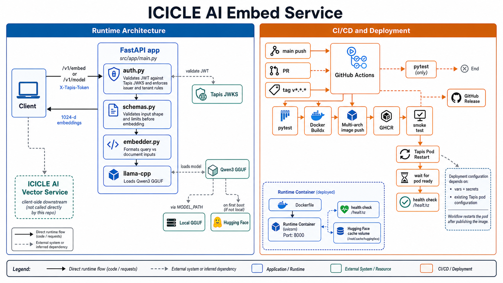

# ICICLE AI Embed Service

FastAPI service that turns text into embedding vectors using **Qwen3-Embedding-0.6B** (GGUF quantized) via **llama-cpp-python**, designed for the **ICICLE AI** Tapis tenant. The service runs the model locally — no external API calls — so a single `.gguf` file plus a Tapis token is everything a deployment needs.

Pairs with the [ICICLE AI Vector Service](https://github.com/ICICLE-ai/icicle-ai-vector-service): this service produces vectors, that service stores and searches them.

**Tags:** `AI4CI` `Software`

### License

[License: GPL v3](https://www.gnu.org/licenses/gpl-3.0)

This project is licensed under the GNU General Public License v3.0. See [LICENSE](LICENSE) for details.

## References

- [Qwen3-Embedding model card](https://huggingface.co/Qwen/Qwen3-Embedding-0.6B)
- [Qwen3-Embedding GGUF repo](https://huggingface.co/Qwen/Qwen3-Embedding-0.6B-GGUF)
- [llama-cpp-python](https://github.com/abetlen/llama-cpp-python)
- [FastAPI Documentation](https://fastapi.tiangolo.com/)
- [Tapis Project](https://tapis-project.org/)
- [Diataxis Framework](https://diataxis.fr/)

## Acknowledgements

*National Science Foundation (NSF) funded AI institute for Intelligent Cyberinfrastructure with Computational Learning in the Environment (ICICLE) (OAC 2112606)*

## Issue Reporting

Please report issues via [GitHub Issues](https://github.com/ICICLE-ai/icicle-ai-embed-service/issues). Include steps to reproduce, expected behavior, and any relevant logs.

---

# Tutorials

## Quickstart

### Prerequisites

- Python 3.11+
- A C/C++ toolchain and `cmake` (Xcode CLT on macOS: `xcode-select --install`; `build-essential cmake` on Debian/Ubuntu) — `llama-cpp-python` builds a native extension
- ~700 MB free disk for the default Q8_0 quant
- A valid ICICLE AI Tapis access token

### Step 1: Configure Environment

```bash
cp .env.example .env
```


| Variable                 | Required | Description                                                                                          |
| ------------------------ | -------- | ---------------------------------------------------------------------------------------------------- |
| `MODEL_PATH`             | no       | Absolute path to a local `.gguf` file. If set, overrides the Hugging Face download.                  |
| `MODEL_REPO`             | no       | Hugging Face repo id. Default `Qwen/Qwen3-Embedding-0.6B-GGUF`.                                      |
| `MODEL_FILE`             | no       | Quant file inside the repo. Default `Qwen3-Embedding-0.6B-Q8_0.gguf`.                                |
| `N_CTX`                  | no       | Context window in tokens. Default `8192`. Model max is `32768`.                                      |
| `N_THREADS`              | no       | CPU threads. `0` = let llama.cpp pick.                                                               |
| `N_GPU_LAYERS`           | no       | Layers to offload to GPU. `-1` = all (default), `0` = pure CPU. On macOS this enables Metal.         |
| `N_BATCH`                | no       | Compute-graph batch size. Default `512`.                                                             |
| `MAX_INPUTS_PER_REQUEST` | no       | DOS guard. Cap on the number of strings per `/v1/embed` call. Default `256`.                        |
| `MAX_CHARS_PER_INPUT`    | no       | DOS guard. Cap on length of any single input string. Default `200000`.                              |
| `TAPIS_ISSUER`           | no       | JWT issuer to validate. Defaults to `https://icicleai.tapis.io/v3/tokens`.                           |
| `TAPIS_JWKS_URL`         | no       | JWKS endpoint for token signature verification. Defaults to ICICLE's JWKS endpoint.                  |
| `TAPIS_TENANT_ID`        | no       | Allowed Tapis tenant. Defaults to `icicleai`.                                                        |
| `APP_ENV`                | no       | `dev` or `prod`.                                                                                     |
| `ALLOWED_ORIGINS`        | no       | JSON array of CORS origins. Defaults to `["*"]`.                                                     |


### Step 2: Install and Run

```bash
uv venv
source .venv/bin/activate
uv pip install -e .
uvicorn src.app.main:app --reload --host 0.0.0.0 --port 8001
```

First boot downloads the GGUF from Hugging Face (cached under `~/.cache/huggingface`). Subsequent boots load from cache in seconds.

### Step 3: Verify

```bash
curl http://localhost:8001/healthz
# {"status": "ok"}
```

---

# How-To Guides

## Authentication

Every request (except `/healthz`) requires a valid **ICICLE AI tenant** Tapis access token in the `X-Tapis-Token` header. The service:

- Verifies the JWT signature via JWKS
- Checks the token is not expired
- Validates the issuer matches `TAPIS_ISSUER`
- Ensures `tapis/token_type` is `access`
- Ensures `tapis/tenant_id` is `icicleai`
- Extracts `tapis/username` for per-request logging

### How to get your access token

Log in to the [ICICLEaaS Portal](https://icicleai.tapis.io), click your username in the bottom-left corner, and select **Copy Access Token**.


| Scenario                   | Status | Response                                                                        |
| -------------------------- | ------ | ------------------------------------------------------------------------------- |
| No `X-Tapis-Token` header  | `422`  | `"field required"`                                                              |
| Expired token              | `401`  | `"Token has expired. Please obtain a fresh access token."`                      |
| Wrong issuer               | `401`  | `"Invalid token issuer. Expected issuer: ..."`                                  |
| Non-access token           | `401`  | `"Only Tapis access tokens are accepted..."`                                    |
| Wrong tenant (e.g. `tacc`) | `403`  | `"Access denied. This service only accepts tokens from the 'icicleai' tenant."` |
| Invalid/malformed token    | `401`  | `"Token validation failed. Ensure you are sending a valid Tapis access token."` |


## How to Embed a Document

Documents are embedded as-is — Qwen3-Embedding's instruction template is **not** applied, because the document side of an asymmetric retrieval pair shouldn't carry a query prompt.

```bash
curl -X POST http://localhost:8001/v1/embed \
  -H "X-Tapis-Token: $TAPIS_TOKEN" \
  -H "Content-Type: application/json" \
  -d '{
    "input": "Photosynthesis is the process by which green plants convert light into chemical energy.",
    "input_type": "document"
  }'
```

Response (`200`):

```json
{
  "model": "Qwen/Qwen3-Embedding-0.6B-GGUF/Qwen3-Embedding-0.6B-Q8_0.gguf",
  "dim": 1024,
  "input_type": "document",
  "normalized": true,
  "data": [
    { "index": 0, "embedding": [0.021, -0.084, "..."] }
  ]
}
```

## How to Embed a Query

For queries, set `input_type: "query"` so the service wraps the text with the Qwen3 retrieval-instruction template before embedding. This materially improves retrieval quality against documents embedded without the template.

```bash
curl -X POST http://localhost:8001/v1/embed \
  -H "X-Tapis-Token: $TAPIS_TOKEN" \
  -H "Content-Type: application/json" \
  -d '{
    "input": "how do plants make food",
    "input_type": "query"
  }'
```

## How to Use a Custom Instruction

For non-retrieval tasks (clustering, classification, code search), override the default instruction. It only takes effect when `input_type="query"`.

```json
{
  "input": "how do plants make food",
  "input_type": "query",
  "instruction": "Given a biology question, retrieve passages that contain the answer"
}
```

## How to Batch Embed

Pass a list. Inputs are embedded serially against the shared llama.cpp context and returned in the same order.

```bash
curl -X POST http://localhost:8001/v1/embed \
  -H "X-Tapis-Token: $TAPIS_TOKEN" \
  -H "Content-Type: application/json" \
  -d '{
    "input": [
      "first chunk of text",
      "second chunk of text",
      "third chunk of text"
    ],
    "input_type": "document"
  }'
```

The list is capped at `MAX_INPUTS_PER_REQUEST` items, and each string at `MAX_CHARS_PER_INPUT` characters. Oversized requests are rejected with `422` before the embedder is invoked.

## How to Use the Embedding with the Vector Service

The same Tapis token works against both services — embed here, store there.

```bash
# 1. Embed the passage
VEC=$(curl -s -X POST http://localhost:8001/v1/embed \
  -H "X-Tapis-Token: $TAPIS_TOKEN" \
  -H "Content-Type: application/json" \
  -d '{"input":"Photosynthesis...","input_type":"document"}' \
  | jq -c '.data[0].embedding')

# 2. Store it in the vector service
curl -X POST http://localhost:8000/v1/embeddings \
  -H "X-Tapis-Token: $TAPIS_TOKEN" \
  -H "Content-Type: application/json" \
  -d "{
    \"embedding\": $VEC,
    \"collection\": \"biology\",
    \"topic\": \"plant\",
    \"chunks\": [\"Photosynthesis...\"],
    \"embedding_model\": \"Qwen3-Embedding-0.6B-Q8_0\"
  }"
```

For retrieval, embed the query with `input_type: "query"` and POST the resulting vector to `/v1/retrieve` on the vector service.

## How to Pick a Quant

All files live in [`Qwen/Qwen3-Embedding-0.6B-GGUF`](https://huggingface.co/Qwen/Qwen3-Embedding-0.6B-GGUF). Drop the filename into `MODEL_FILE`.


| File                              | Size    | RAM     | Quality vs fp16 | When to use                                       |
| --------------------------------- | ------- | ------- | --------------- | ------------------------------------------------- |
| `Qwen3-Embedding-0.6B-Q8_0.gguf`  | ~650 MB | ~800 MB | ~99.9%          | Default. Tight fidelity, low memory.              |
| `Qwen3-Embedding-0.6B-f16.gguf`   | ~1.2 GB | ~1.5 GB | 100%            | Reference / benchmarking.                         |


For larger Qwen variants, swap `MODEL_REPO` to `Qwen/Qwen3-Embedding-4B-GGUF` (dim 2560) or `Qwen/Qwen3-Embedding-8B-GGUF` (dim 4096) and pick a matching quant file.

## Troubleshooting

- **"Failed to initialise embedder" at startup**: the service exits if it can't load the model. Check `MODEL_PATH` (file exists?) or that you have network access to Hugging Face on first boot.
- **`401`/`403` errors**: ensure your Tapis token is fresh, from the `icicleai` tenant, and passed via the `X-Tapis-Token` header.
- **`422` "input list exceeds max_inputs_per_request"**: split the request, or raise `MAX_INPUTS_PER_REQUEST` if your deployment can absorb it.
- **`422` "input exceeds max_chars_per_input"**: chunk the text on the client; this service does no chunking.
- **Slow first request**: model load happens at startup, but the first embedding triggers JIT compilation of the compute graph. Subsequent requests are much faster.
- **High RAM**: lower `N_CTX` (e.g. `2048`) or move from f16 to Q8_0.
- **No GPU acceleration on Mac**: confirm `llama-cpp-python` was installed on Apple Silicon Python, not under Rosetta. `python -c "import platform; print(platform.machine())"` should print `arm64`.

---

# Explanation

## Architecture



The diagram above shows how the service sits between client requests and the underlying model on Tapis Pods, with persistent volume storage for cached GGUF weights and the workflow-driven path from GitHub to GHCR to the running pod.

For a closer look at what happens **inside** a single request — auth, validation, the serialized embedder, and pooling — the textual flow below maps to the actual code path in `src/app/`:

```
                    ICICLE AI Embed Service
                       ┌──────────────────────────────────────────────────┐
                       │                                                  │
  Client Request       │   FastAPI Application                            │
  (X-Tapis-Token)      │                                                  │
        |              │   ┌──────────┐    ┌───────────────────────────┐  │
        v              │   │  Auth    │    │   /v1/embed handler       │  │
  ┌──────────┐         │   │  (JWKS)  │    │                           │  │
  │  POST    │────────>│   │          │───>│  Pydantic validation:     │  │
  │ /v1/embed│         │   │ Verify   │    │   - non-empty strings     │  │
  │          │         │   │ JWT sig  │    │   - len <= max_chars      │  │
  └──────────┘         │   │ Check    │    │   - count <= max_inputs   │  │
                       │   │ expiry   │    │                           │  │
                       │   │ Validate │    │  Format query / document  │  │
                       │   │ tenant + │    │  template                 │  │
                       │   │ access   │    └───────────┬───────────────┘  │
                       │   └──────────┘                │                  │
                       │                               v                  │
                       │                  ┌───────────────────────────┐   │
                       │                  │  Embedder (singleton)     │   │
                       │                  │                           │   │
                       │                  │  ┌─────────────────────┐  │   │
                       │                  │  │  threading.Lock     │  │   │
                       │                  │  │   (serializes       │  │   │
                       │                  │  │    embed() calls)   │  │   │
                       │                  │  └──────────┬──────────┘  │   │
                       │                  │             v             │   │
                       │                  │  ┌─────────────────────┐  │   │
                       │                  │  │  llama_cpp.Llama    │  │   │
                       │                  │  │   embedding=True    │──┼───┼──> Metal / AVX2 / NEON
                       │                  │  │   pooling: last     │  │   │   (quantized matmul)
                       │                  │  │   GGUF on disk      │  │   │
                       │                  │  └─────────────────────┘  │   │
                       │                  └───────────────────────────┘   │
                       │                               │                  │
                       │                               v                  │
                       │                       L2 normalize (opt)         │
                       │                               │                  │
                       │                               v                  │
                       │                          JSON response           │
                       └──────────────────────────────────────────────────┘
```

## How Embedding Works

```
  raw text  ──>  optional query template  ──>  tokenize  ──>  forward pass  ──>  pool  ──>  normalize
  "how do          "Instruct: ...\n             [bos, ...,      transformer       last     v / |v|
   plants           Query: how do                eos]            (quantized)       token
   make food"       plants make food"                                              hidden
                                                                                   state
```

- **Tokenization**: handled by llama.cpp from the GGUF's bundled tokenizer.
- **Forward pass**: 28 transformer layers, 1024-dim hidden, run on Metal on macOS / AVX2-AVX-512 on x86 / NEON on ARM. Quantized weights mean every matmul is int8 (Q8_0) or 4-bit (Q4_K_M variants).
- **Pooling**: last-token pooling, baked into the GGUF metadata. The service does not override this.
- **Normalize**: L2 normalize on by default so dot product == cosine similarity downstream.

## Design Decisions

- **llama.cpp over PyTorch/transformers**: no PyTorch install (saves ~2 GB), native Metal on Mac, hand-tuned AVX2/AVX-512/NEON kernels for CPU quantized matmul. Materially faster than PyTorch on CPU for this model size, with a fraction of the memory footprint.
- **Q8_0 by default**: for embedding models the quality delta vs fp16 is within retrieval noise. Drop to f16 only when you need reference vectors.
- **Single-process, serialized embedding**: `llama-cpp-python`'s `embed()` mutates the shared context and is not thread-safe. The embedder holds a `threading.Lock` and runs work on `anyio.to_thread` so the FastAPI event loop stays free. For higher throughput, scale horizontally (more replicas) rather than threading a single model.
- **Pooling type comes from the GGUF**: Qwen3-Embedding uses last-token pooling, baked into the file's metadata. Overriding `pooling_type` would silently corrupt the vectors.
- **Instruction-aware by default**: Qwen3-Embedding expects query/document asymmetry. The `input_type` flag keeps clients from having to format the template themselves; `instruction` lets advanced users override it per-request.
- **L2-normalize by default**: the vector service uses cosine similarity; normalized vectors make scores comparable across models and turn dot product into cosine.
- **No server-side chunking**: the service embeds what it's given. Callers own chunking, because chunk strategy is domain-specific.
- **Auth boundary mirrors the vector service**: same Tapis JWT validation (signature + issuer + access-token-type + tenant). One token works across the embed→store→retrieve pipeline.

## Security Posture

- **Mandatory Tapis JWT** on every endpoint except `/healthz`. There is no bypass flag — auth is on whether you're running locally or in production. JWTs are validated with `RS256` only (no `none`-algorithm fallback), checked for expiration, issuer, `tapis/token_type == "access"`, and `tapis/tenant_id == "icicleai"`.
- **No request-body logging**. Logs include payload shape (`len(texts)`, `total_chars`) and the authenticated `username`, never the raw input text. Tokens are never logged.
- **Request size limits**. `MAX_INPUTS_PER_REQUEST` and `MAX_CHARS_PER_INPUT` cap how much work a single request can ask for, validated by Pydantic before the embedder is touched.
- **Single shared model context**. Requests are serialized at the embedder level so a malicious client cannot race the GGUF context into an inconsistent state.
- **No outbound network at request time**. The only network call is the one-time `huggingface_hub` download at startup, skipped entirely when `MODEL_PATH` is set.
- **Container hygiene**. The Docker image runs as a non-root `app` user, ships only runtime libs (no compilers in the final layer), and writes the model cache into a mountable volume so weights persist across restarts without baking into the image.
- **Fail-closed startup**. If model load fails, the process exits with a clear message rather than serving a half-initialized embedder.

> **Data handling notice:** input text is held in memory only for the duration of the request. Nothing is persisted by this service.

---

# Reference

## API Endpoints

All endpoints (except `/healthz`) require the `X-Tapis-Token` header.


| Method | Endpoint    | Description                       |
| ------ | ----------- | --------------------------------- |
| `GET`  | `/healthz`  | Health check (no auth)            |
| `GET`  | `/v1/model` | Model name, dim, context length   |
| `POST` | `/v1/embed` | Generate embeddings for text(s)   |


## Request Fields

### Embed (`POST /v1/embed`)


| Field         | Required | Description                                                                                                          |
| ------------- | -------- | -------------------------------------------------------------------------------------------------------------------- |
| `input`       | yes      | Single string or list of strings. Each must be non-empty. List length capped by `MAX_INPUTS_PER_REQUEST`.            |
| `input_type`  | no       | `"document"` (default) embeds text as-is. `"query"` wraps with the Qwen3 instruction template for asymmetric search. |
| `instruction` | no       | Custom task instruction for queries (max 2000 chars). Ignored when `input_type="document"`.                          |
| `normalize`   | no       | L2-normalize vectors (default `true`). Keep on for cosine search against the vector service.                         |


### Model Info (`GET /v1/model`)

No body. Returns the loaded model's identifier, dimension, and context length.


## Response Fields

### Embed Response


| Field         | Description                                                |
| ------------- | ---------------------------------------------------------- |
| `model`       | Identifier of the loaded GGUF (`repo/file` or local stem). |
| `dim`         | Vector dimension (1024 for the 0.6B model).                |
| `input_type`  | Echo of the request's `input_type`.                        |
| `normalized`  | Echo of the request's `normalize` flag.                    |
| `data`        | List of `{index, embedding}` pairs in input order.         |


## OpenAPI Schema

A full OpenAPI 3.1 specification is shipped alongside this README at [`openapi.json`](openapi.json). The live FastAPI app also exposes it at `GET /openapi.json` and an interactive Swagger UI at `GET /docs`.

---

# Docker

## Build

```bash
DOCKER_BUILDKIT=1 docker build -t icicle-ai-embed-service .
```

The Dockerfile uses BuildKit cache mounts for both `apt` and `pip` plus `ccache` for the C++ compiler, so the second build of an unchanged `llama-cpp-python` is near-instant. For GPU inside a container, rebuild with `--build-arg` overrides or pass `CMAKE_ARGS="-DGGML_CUDA=on"` (or `-DGGML_VULKAN=on`) at build time. On macOS, run the service natively to get Metal acceleration — Docker Desktop doesn't expose Metal to containers.

## Run

The image declares `/home/app/.cache/huggingface` as a `VOLUME`. Mount **any** persistent storage there and the GGUF will be downloaded once and reused across restarts.

### Local development

```bash
docker run --rm -p 8001:8000 \
  -v "$HOME/.cache/huggingface:/home/app/.cache/huggingface" \
  --env-file .env \
  icicle-ai-embed-service
```

### Tapis Pods (ICICLE deployment)

The Tapis-managed volume `hfembedmodel` (1 GiB, `AVAILABLE`) is sized for the small embedding GGUFs. Map it onto the container's cache directory in the pod definition:

```yaml
volume_mounts:
  - volume_id: hfembedmodel
    mount_path: /home/app/.cache/huggingface
```

The volume name is **not** baked into the image. Any Tapis tenant, Kubernetes PVC, or Docker named volume can be plugged into the same path — the Dockerfile is deployment-agnostic on purpose.

### Healthcheck

The image ships a `HEALTHCHECK` that hits `/healthz` every 30s with a 120s start-period (model load can be slow on cold start). Orchestrators that have their own probes (Kubernetes, Tapis Pods) can ignore it; plain `docker run` will surface container health via `docker ps`.
